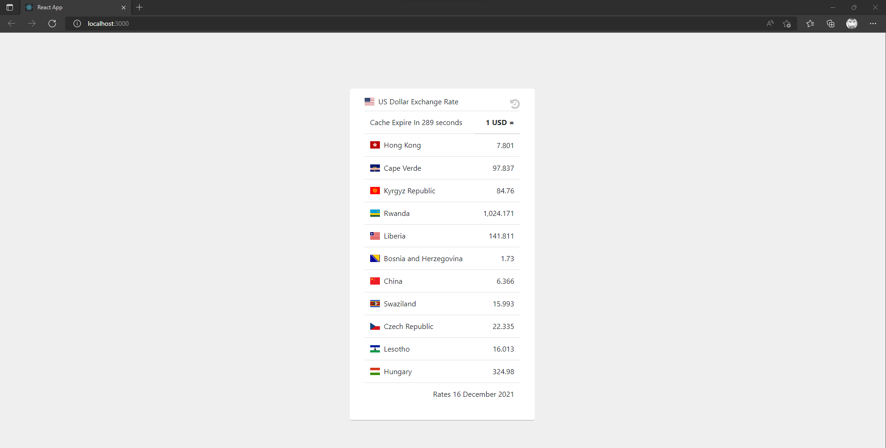

# Phalcon REST API

[](https://github.com/davellanedam/phalcon-micro-rest-api-skeleton/blob/master/LICENSE)



## Getting started

This is a basic REST API architecture.

## Features

- Multiple Cache Module Implemented (file/memcache/apc) default file
- The first endpoint created with normal PHP CURL and the second one created using to Guzzle.
- Setup configuration for the development, staging, production.
- Timezone ready: Work UTC time (GMT+0). Responses with iso8601 date/time format.

## Min Requirements

-   Apache **2**
-   PHP **5.6+**
-   Phalcon **3.4.3**
-   MySQL **5.5+**

## How to install


1. You need to [install composer](https://getcomposer.org/download/) if you haven´t already.
2. Confirm Dockerfile(used same image that sent in the email).
3. Execute the below commands

```bash
docker build . -t phalcon-demo
docker run -p 9900:80 phalcon-demo
```


### Endpoints:
```bash
PHP Curl Module 1
http://localhost:9900/get-exchange-data

Guzzle Package Module 2
http://localhost:9900/get-exchange-data-guzzle
```